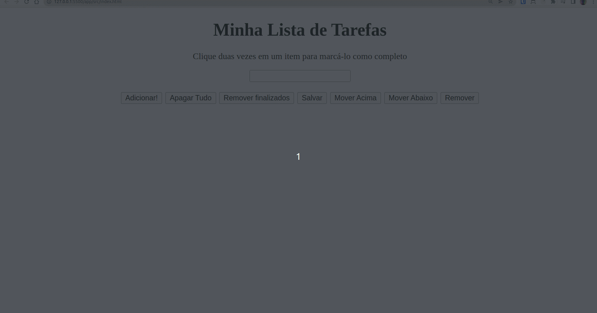

## O que é o projeto Trybe Color Picker: 

Para este projeto, tive que desenvolver uma lista de tarefas simples, na qual a pessoa usuária poderá adicionar tarefas a serem cumpridas e, ao clicar duas vezes em cima de alguma delas, finalizar referida tarefa. 

Também é possível salvar a lista de tarefas no localstorage do browser da pessoa, permitindo que sua lista permaneça salva mesmo após fechar o site. 

## Exemplo

